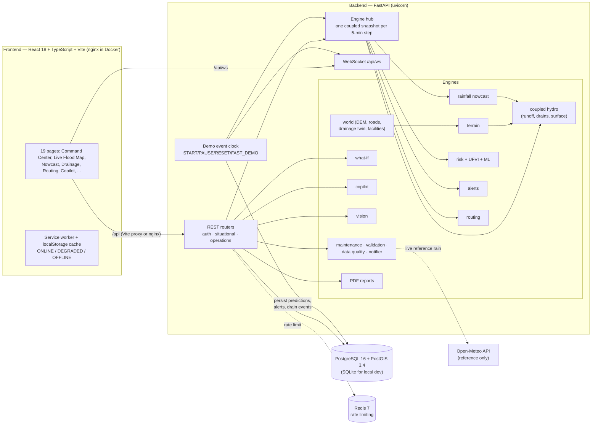

# FloodShield AI

**Predict the Flood. Protect the City. Respond Before Impact.**

FloodShield AI is a software-only urban flood nowcasting and response platform built for
Smart India Hackathon 2026, problem statement **SIH26085 — "Urban Flood Nowcasting System: Drainage and
Rainfall Coupling"**. It couples an AI rainfall nowcast with terrain analysis, surface runoff, a drainage-network
digital twin and a 2D surface-flow model to predict street-level flooding up to 3 hours ahead. It then turns
that prediction into explainable risk scores, multilingual early warnings, flood-safe emergency routing and
municipal response workflows.

The platform does not use or depend on any hardware, IoT devices or physical sensors. Every input is
either software-generated (simulation / demo data), fetched from a public web API, uploaded by a user, or
predicted by a model, and each API response says which of these it is (see [Data labelling](#data-labelling-policy)).

```
Weather / radar-like field → AI rainfall nowcast → DEM / terrain → runoff (SCS-CN) → surface flow
→ drainage hydraulics → coupled flood prediction → street-level risk → early warning
→ emergency routing → infrastructure impact → municipal response
```

---

## The five questions

A flood-response officer has to answer five questions. The table shows which modules answer each one.

| Question | What the platform provides | Modules |
|---|---|---|
| **WHERE** will it flood? | Flood depth grid, connected flood zones (GeoJSON), flooded road segments, affected wards and facilities | `engines/hydro.py`, `engines/hub.py` (`flood_grid`, `_zones`), `/api/flood/*`, `/api/map/dynamic` |
| **WHEN** will it flood? | Rainfall nowcast at +15/30/45/60/90/120/180 min, per-road *time-to-flood*, a flood propagation timeline from NOW to +180 min | `engines/rainfall.py`, `/api/rainfall/forecast`, `/api/flood/timeline`, `/api/flood/roads` |
| **HOW DEEP** will it get? | Water depth now and at each horizon for every road and grid cell, vehicle passability class, flood probability | `engines/hydro.py`, `engines/hub.py`, `/api/flood/roads/{id}`, `/api/flood/forecast` |
| **WHY** is it high risk? | Explainable weighted risk factors with % contributions, drainage node state and blockage, ML susceptibility, Urban Flood Vulnerability Index, alert triggers | `engines/risk.py`, `engines/alerts.py`, `/api/risk/explain`, AI Copilot |
| **WHAT** should we do? | Authority and citizen actions per alert level, flood-safe routes per vehicle type, alternative facilities, incidents, drain maintenance priorities, PDF incident report | `engines/alerts.py`, `engines/routing.py`, `engines/ops.py`, `engines/reports.py`, `/api/incidents`, `/api/reports/incident.pdf` |

---

## Features

**Prediction and hydrology**
- **AI rainfall nowcasting**: FFT phase-correlation storm motion, semi-Lagrangian advection, a damped trend,
  a gradient-boosted growth/decay model trained on a synthetic storm library, and a 16-member ensemble that
  gives heavy-rain probability and confidence at 7 horizons. Anomalies such as cloudburst-class intensity and
  rapid intensification are flagged.
- **Terrain analysis**: priority-flood depression filling, D8 flow direction, flow accumulation, catchments,
  slope and aspect, low-lying areas, and natural water paths.
- **Runoff**: SCS Curve Number on cumulative rainfall, applied per grid cell, with land-use CN and imperviousness.
- **Drainage digital twin**: manholes, junctions, street inlets, pipes and box drains, and river outfalls. Conduits
  are sized with the rational method and Manning's equation. The twin models inlet capture, topological routing,
  backwater, manhole surcharge storage and overflow. Each node is classified as NORMAL / HIGH_LOAD /
  NEAR_CAPACITY / OVERLOADED / OVERFLOW.
- **Coupled 1D–2D flood model**: drain overflow returns to a diffusive cellular-automaton surface-flow model
  on the DEM.
- **Street-level flood intelligence** for every road segment: depth now and at each horizon, probability,
  time-to-flood, duration, passability, drainage status, and a plain-language explanation.

**Risk and warning**
- **Explainable risk engine**: 12 weighted factors, 5 risk levels, and physics-based overrides. An ML
  susceptibility classifier (scikit-learn GradientBoosting) provides a second opinion.
- **Urban Flood Vulnerability Index (UFVI)** for each ward.
- **Early warning**: GREEN / YELLOW / ORANGE / RED alerts per ward. Thresholds are configurable. Citizen
  messages are available in English, Hindi, Telugu, Tamil and Marathi. Alerts can be delivered to web clients over
  WebSocket, by e-mail (SMTP) or by SMS (HTTP gateway); unconfigured channels are logged as `SIMULATED`.

**Response**
- **Flood-safe routing** for 7 modes: normal vehicle, ambulance, fire tender, police, high-clearance rescue,
  bus and pedestrian. Each mode has its own safe-depth limit, and the router compares its route with the
  flood-blind shortest path.
- **Critical infrastructure impact**: hospitals, police, fire, schools, stations, shelters, substations and
  government offices. Each facility is classified as FLOODED / ISOLATED / ACCESS_RESTRICTED / AT_RISK / OPERATIONAL,
  and the nearest reachable alternative is suggested.
- **What-If simulator**: compares a baseline and a scenario for rainfall intensity or multiplier, duration,
  drainage capacity, blockage, imperviousness, river tailwater and initial ponding.
- **AI Copilot**: grounded question answering over the live engine snapshot. It never invents numbers.
- **Incidents**: create incidents directly or from an alert, then track them from OPEN → ACKNOWLEDGED →
  IN_PROGRESS → RESOLVED with notes.
- **Predictive drain maintenance**: each drain is ranked for REPAIR, CLEAN, INSPECT or MONITOR.
- **Emergency & helplines**: 112 is the primary number, followed by national helplines. Local numbers are
  editable and marked unverified until a municipality confirms them.
- **PDF flood incident report** with a vector flood map, nowcast, timeline, affected roads, facilities,
  drainage failures, alerts, emergency route and validation summary.

**Citizen and media inputs**
- **Citizen reports** with an optional photo. Uploaded photos are analysed automatically, reports go through
  moderation, and each report is cross-checked against the model depth.
- **CCTV / image and video analysis** of uploaded media with OpenCV: water segmentation, reflection cues,
  vehicle/obstacle blobs and a depth *estimate*. YOLOv8 is used if it is installed. The platform does not
  connect to live cameras.

**Platform**
- JWT authentication with 5 roles, admin approval for privileged roles, password reset, audit log and
  per-IP rate limiting (Redis-backed when configured).
- A demo event clock (START / PAUSE / RESET / FAST_DEMO / SEEK) drives the whole platform. A live WebSocket
  broadcasts KPIs and alerts at every 5-minute model step.
- Model validation endpoint (twin experiment, clearly labelled `DEMO_VALIDATION`) and data-quality monitor.
- Six configurable cities: Hyderabad (default), Mumbai, Delhi, Chennai, Bengaluru and Visakhapatnam.

---

## Architecture



See [docs/ARCHITECTURE.md](docs/ARCHITECTURE.md) for the data flow, the caching model and the database schema.

---

## Quick start

### Local development (SQLite, no Docker)

Requirements: Python 3.11 and Node.js 20.

```bash
make install          # creates .venv, installs backend requirements and frontend npm packages
make dev-backend      # http://localhost:8000  (Swagger UI: http://localhost:8000/api/docs)
make dev-frontend     # http://localhost:5173  (Vite proxies /api -> http://localhost:8000)
```

On first start, the backend creates `backend/floodshield.db` (SQLite) and seeds demo users, helplines,
GIS tables, the historical catalogue and demo reports. It then warms the Hyderabad engine, which takes
a few seconds. You can also seed explicitly with `make seed`, or run
`cd backend && ../.venv/bin/python -m scripts.seed --all-cities` to seed all six cities.

Local development needs no `.env` file. The defaults use SQLite, in-memory rate limiting and the simulated
storm. Do **not** copy `.env.example` to `backend/.env` for local runs unless you change `FS_DATABASE_URL`,
because the example points at the Docker host `db`.

Run the tests:

```bash
make test             # 65 pytest tests, ~25 s
```

### Docker (PostgreSQL + PostGIS, Redis, nginx)

```bash
cp .env.example .env  # optional: override FS_SECRET_KEY etc.
make docker-up        # = docker compose up -d --build
```

| Service | URL / port | Image |
|---|---|---|
| frontend | http://localhost:8080 | built from `frontend/Dockerfile` (nginx; proxies `/api` and `/api/ws` to backend) |
| backend | http://localhost:8000 (`/api/docs`) | built from `backend/Dockerfile` |
| db | internal 5432 | `postgis/postgis:16-3.4` |
| redis | internal 6379 | `redis:7-alpine` |

Stop the stack with `make docker-down`. See [docs/DEPLOYMENT.md](docs/DEPLOYMENT.md) for environment variables
and production hardening.

---

## Demo accounts

| Role | E-mail | Password |
|---|---|---|
| ADMIN | `admin@floodshield.local` | `Admin@123` (set by `FS_SEED_ADMIN_PASSWORD`) |
| MUNICIPAL_OFFICER | `officer@floodshield.local` | `Demo@123` |
| EMERGENCY_RESPONDER | `responder@floodshield.local` | `Demo@123` |
| ANALYST | `analyst@floodshield.local` | `Demo@123` |
| CITIZEN | `citizen@floodshield.local` | `Demo@123` |

Anyone can self-register. Accounts always start as CITIZEN. If a user requests a privileged role, it is stored as
`requested_role` and becomes active only after an ADMIN approves it with `PATCH /api/users/{id}`.

A 5–7 minute judging walkthrough is in [docs/DEMO.md](docs/DEMO.md).

---

## Data labelling policy

Every API response (and most records inside responses) carries a `data_label`. The frontend shows it, so no
simulated value can be mistaken for a measurement.

| Label | Meaning | Examples in this build |
|---|---|---|
| `LIVE_DATA` | Fetched from an external live source at request time | Open-Meteo point precipitation (`/api/rainfall/live`). This is shown for reference only and does not drive the model. |
| `HISTORICAL_DATA` | Verified historical records | Reserved for imported municipal/IMD records. None ship with the platform. |
| `SIMULATED_DATA` | Output of a deterministic simulation | Radar-like rainfall field, current flood state driven by that rainfall, What-If runs |
| `DEMO_DATA` | Synthetic geography or catalogues generated for demonstration | DEM, land cover, roads, drainage network, facility locations, historical flood catalogue |
| `MODEL_PREDICTION` | Forecast or derived by a model | Nowcast, flood forecast, risk, alerts, routes, maintenance priorities |
| `USER_REPORTED_DATA` | Supplied by users | Citizen reports, uploaded CCTV/image/video analysis (depths are labelled *ESTIMATE*) |

Drain blockage values are also marked `ASSUMED (SIMULATED maintenance-age model — no sensors)`, and model
validation is labelled `DEMO_VALIDATION`, which is kept separate from real-world validation.

---

## Tech stack

| Layer | Technology |
|---|---|
| API | Python 3.11, FastAPI, Uvicorn, Pydantic v2, pydantic-settings |
| Data | SQLAlchemy 2.0; PostgreSQL 16 + PostGIS 3.4 (Docker) or SQLite (local); geometry stored as GeoJSON |
| Science / ML | NumPy, SciPy, scikit-learn (GradientBoosting, HistGradientBoosting); LightGBM / XGBoost used automatically if installed |
| GIS / graphs | Shapely, pyproj, NetworkX |
| Computer vision | OpenCV (headless); optional Ultralytics YOLOv8 |
| Reports | ReportLab (vector PDF) |
| Security | PyJWT (HS256), bcrypt, role-based access, audit log, Redis/in-memory rate limiting |
| Frontend | React 18, TypeScript, Vite, Tailwind CSS, Framer Motion, React-Leaflet, Recharts, Lucide icons |
| Delivery | Docker, docker compose, nginx |

---

## Repository layout

```
floodshield-ai/
├── backend/
│   ├── app/
│   │   ├── main.py              FastAPI app, middleware, lifespan (init DB, seed, warm engine, start clock)
│   │   ├── core/                config, database, security (JWT/RBAC), rate limiting, audit
│   │   ├── data/cities.py       six configurable cities (centre, relief, wards, street names)
│   │   ├── models/              SQLAlchemy ORM models
│   │   ├── engines/             world, terrain, rainfall, hydro, hub, risk, alerts, routing,
│   │   │                        simulation, vision, copilot, ops, reports, historical, demo
│   │   └── routers/             auth.py, situational.py, operations.py
│   ├── scripts/seed.py          idempotent seed (python -m scripts.seed [--all-cities])
│   ├── tests/                   pytest suite (engines + API)
│   ├── requirements.txt
│   └── Dockerfile
├── frontend/                    React + Vite SPA (Dockerfile + nginx.conf for production)
├── docs/                        architecture, API, ML, GIS, hydraulics, simulation, demo, deployment
├── docker-compose.yml           frontend · backend · db · redis
├── Makefile
└── .env.example
```

## Frontend

The frontend is a React 18 + TypeScript single-page application built with Vite and styled with Tailwind CSS.
It uses React-Leaflet for maps, Recharts for charts, Framer Motion for animation and Lucide for icons. Pages:

Dashboard (Municipal Command Center) · Live Flood Map · Rainfall Nowcast · Terrain & Runoff · Drainage Network ·
Flood Prediction · Risk Analysis · What-If Simulator · Emergency Routing · Infrastructure · CCTV Analysis ·
Citizen Reports · Historical Analytics · Drain Maintenance · Emergency & Helplines · AI Copilot · Incidents ·
Reports · Settings, plus Login, Register, Forgot Password and Profile.

The frontend caches data offline with a service worker and localStorage, and shows an ONLINE / DEGRADED / OFFLINE
connection status. The UI is available in English, Hindi, Telugu, Tamil and Marathi. The dev server runs on port 5173
and proxies `/api` to `http://localhost:8000`.

---

## Documentation

| Document | Contents |
|---|---|
| [docs/ARCHITECTURE.md](docs/ARCHITECTURE.md) | Components, data flow, snapshot caching, event clock, database schema, security |
| [docs/API.md](docs/API.md) | Every endpoint by group, with method, role, parameters and example responses |
| [docs/ML.md](docs/ML.md) | Nowcasting, risk engine, ML susceptibility, UFVI, computer vision, Copilot grounding, validation numbers |
| [docs/GIS.md](docs/GIS.md) | Grid and bbox, DEM/terrain algorithms, layers, plugging in SRTM/Cartosat, OSM, drainage GIS, PostGIS |
| [docs/HYDRAULICS.md](docs/HYDRAULICS.md) | SCS-CN, Manning, rational method, inlet capture, routing, backwater, surcharge, surface flow, SWMM mapping |
| [docs/SIMULATION.md](docs/SIMULATION.md) | Demo storm profile, event clock modes, What-If parameters and metrics |
| [docs/DEMO.md](docs/DEMO.md) | 5–7 minute judging script |
| [docs/DEPLOYMENT.md](docs/DEPLOYMENT.md) | Docker compose, environment variables, production hardening, scaling |

---

## Limitations

- **Rainfall is simulated.** The flood model is driven by a deterministic, radar-like storm. The platform does
  not ingest Doppler radar (IMD DWR) or rain gauges. The Open-Meteo feed is a single point reference and does not
  drive the model.
- **Geography is synthetic.** The DEM, land cover, roads, drainage network and facility locations are generated
  from a seed for each city. The city centres and ward/street names are real, but the positions and networks are not.
  The code does not yet include a loader for real SRTM/Cartosat DEMs, OSM roads or municipal drainage GIS.
  [docs/GIS.md](docs/GIS.md) describes the integration points.
- **Drain blockage is assumed.** Blockage comes from a maintenance-age model, not from sensors or surveys.
- **The model is coarse.** It uses a 48 × 48 grid (~166 m cells for Hyderabad) and 5-minute steps. Surface flow is a
  4-neighbour diffusive cellular automaton, not a full shallow-water solver, and pipe routing is volume-based rather
  than a dynamic-wave (SWMM-style) solution. The platform does not export or import SWMM `.inp` files; a mapping is
  documented in [docs/HYDRAULICS.md](docs/HYDRAULICS.md).
- **Validation is internal.** The published metrics come from a twin experiment against the platform's own
  synthetic truth (`DEMO_VALIDATION`). No real-world validation has been done. The ML susceptibility model reports
  training accuracy, not held-out accuracy.
- **The historical flood catalogue is synthetic** (`DEMO_DATA`). It was reconstructed with the coupled model.
- **Some state lives in a single process.** The event clock, engine snapshot cache, alert thresholds, road closures
  and notification outbox live in the backend process. They are reset on restart, and the backend must run as a
  single worker.
- **CCTV analysis covers uploaded media only.** Without YOLO weights, vehicle detection is a contour heuristic,
  and all depths are estimates.
- **E-mail and SMS delivery require configuration.** They need `FS_SMTP_HOST` or `FS_SMS_GATEWAY_URL`; otherwise
  deliveries are logged as `SIMULATED`.
- **Local helpline numbers are not verified.** Only national numbers ship verified. Local control-room numbers must be
  entered and verified by the deploying municipality.
