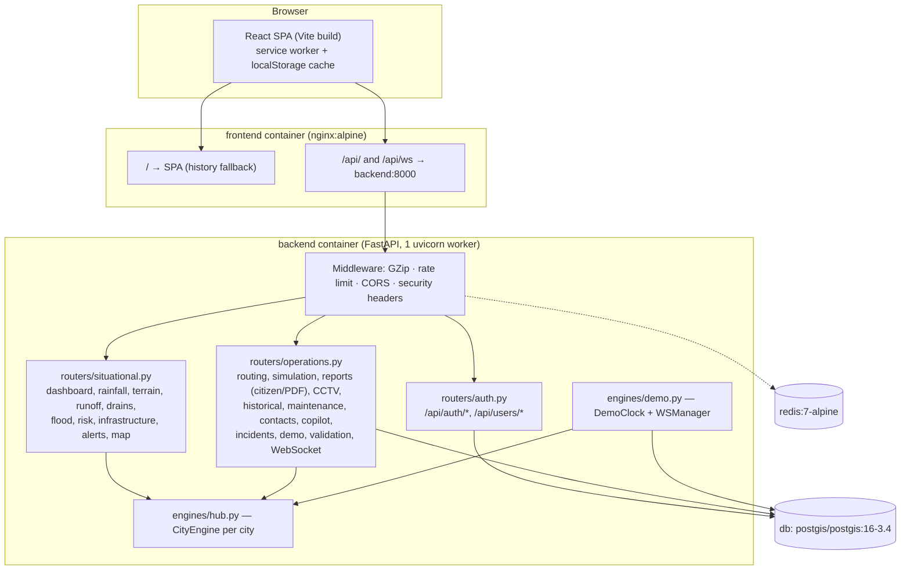
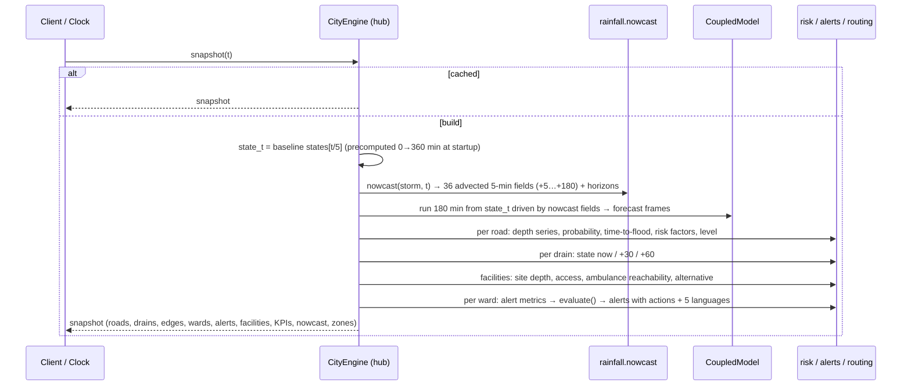

# Architecture

FloodShield AI has two parts: a FastAPI backend that runs all the models, and a React single-page application
that visualises the results. In Docker, a PostgreSQL/PostGIS database and a Redis instance are added. The platform
uses no hardware, IoT devices or sensors.

## Backend components

| Module | Responsibility |
|---|---|
| `app/main.py` | App factory, middleware (GZip, rate limit, CORS, security headers), router registration. The lifespan hook runs `init_db()`, `seed_if_empty()`, warms the default city's engine and starts the clock loop. |
| `app/core/config.py` | `Settings` (pydantic-settings, prefix `FS_`). |
| `app/core/database.py` | SQLAlchemy engine/session. On PostgreSQL it runs `CREATE EXTENSION IF NOT EXISTS postgis` and then `create_all`. |
| `app/core/security.py` | bcrypt password hashing, JWT access/refresh tokens (HS256), `get_current_user` and `require_roles(...)`. `ADMIN` always passes role checks. |
| `app/core/rate_limit.py` | Per-client-IP request limit on `/api/*` (default 240/min). Uses a Redis fixed window when `FS_REDIS_URL` is reachable, otherwise an in-memory sliding window. `/api/ws` is exempt. |
| `app/core/audit.py` | Writes `AuditLog` rows (login, registration, profile change, report, closure, simulation save, incident, PDF, Copilot query, …). |
| `app/data/cities.py` | Six city definitions: centre, span, base elevation, relief, seed, river, 16 ward names, street names, monsoon months. |
| `engines/world.py` | Deterministic "world" per city: DEM, land cover, wards, road graph, drainage digital twin, infrastructure, analysis camera locations. |
| `engines/terrain.py` | Priority-flood, D8, flow accumulation, catchments, slope/aspect, low-lying areas, water paths. |
| `engines/rainfall.py` | `StormScenario` (spatio-temporal rain field) and `nowcast()`. |
| `engines/hydro.py` | `CoupledModel`: SCS-CN runoff, inlet capture, drainage routing, overflow, surface flow, infiltration. |
| `engines/hub.py` | `CityEngine`: precomputed baseline timeline, per-step forecast, and one fully-coupled **snapshot** per 5-minute step that every consumer reads. |
| `engines/risk.py` | Explainable weighted risk, ML susceptibility classifier, UFVI. |
| `engines/alerts.py` | Threshold rules, `evaluate()`, action templates, multilingual citizen messages. |
| `engines/routing.py` | Flood-aware NetworkX routing for 7 modes. |
| `engines/simulation.py` | What-If baseline vs scenario. |
| `engines/copilot.py` | Intent classification and grounded answer rendering. |
| `engines/vision.py` | OpenCV image/video flood analysis, synthetic sample images. |
| `engines/ops.py` | Drain maintenance ranking, twin-experiment validation, Open-Meteo adapter, data-quality monitor, notifier (WEB/EMAIL/SMS). |
| `engines/reports.py` | ReportLab PDF incident report. |
| `engines/historical.py` | Synthetic historical catalogue computed with the coupled model. |
| `engines/demo.py` | Event clock, WebSocket manager, and persistence of model outputs at each step. |

## Data flow for one snapshot

A snapshot is the complete state of the city at one event minute *t*. It is rounded to 5 minutes and limited to
0–180. All REST endpoints, the WebSocket tick, the Copilot and the PDF report read the same snapshot, so every
number on the platform is consistent.

- **Baseline ("truth") timeline.** When `CityEngine` is created, it runs the coupled model 0 → 360 minutes on
  the simulated storm and keeps every frame and state. These frames are the "current" conditions (`SIMULATED_DATA`).
- **Forecast.** At step *t* the nowcast is issued from radar-like observations up to *t* (with ±6 % measurement
  noise). The coupled model is then run forward 180 minutes from the true state at *t*, driven only by the
  nowcast rainfall. Its frames are the `MODEL_PREDICTION`s.
- **Caches.** The engine keeps an LRU of 40 snapshots and 48 forecasts per city. `lru_cache` is also used for
  worlds, terrain analysis, static risk layers, the ML model, UFVI, the historical catalogue and validation.
  Changing alert thresholds or road closures clears the snapshot cache.
- **Compute cost.** On a laptop CPU, the first snapshot takes about 4–5 s including model training; each later
  step takes about 0.5 s.

## Event clock and WebSocket

`DemoClock` (see [SIMULATION.md](SIMULATION.md)) holds the current event minute. It ticks once per second in a
background asyncio task. Whenever the 5-minute step changes, it:

1. builds or reads the snapshot (in a worker thread);
2. broadcasts `{"type": "tick", minute, mode, kpis, alerts[:12], ...}` to every `/api/ws` client;
3. persists a `FloodPrediction`, an `AIPrediction` (nowcast) and the active `Alert`s. It deactivates older alerts
   and records `DrainageEvent`s for OVERLOADED/OVERFLOW nodes.

Between steps it broadcasts `{"type": "clock", ...}`. Other messages are `hello` (on connect),
`alert_broadcast` (manual WEB notification), `citizen_report` (new or moderated) and `incident` (incident update).

## Database schema

Tables are created with `Base.metadata.create_all` (no migration tool). Geometry is stored as GeoJSON in `JSON`
columns so that SQLite works. On PostgreSQL, the same GeoJSON can be cast with `ST_GeomFromGeoJSON` (see
[GIS.md](GIS.md#postgis)).

| Group | Tables |
|---|---|
| Identity | `users` (role, requested_role, language, theme, notification prefs), `roles`, `password_resets`, `audit_logs` |
| GIS (seeded per city) | `dem_tiles`, `land_cover`, `roads`, `drainage_nodes`, `drainage_edges`, `infrastructure` (IDs prefixed with the city, e.g. `hyd-R001`) |
| Model outputs | `rainfall_observations`, `rainfall_forecasts`, `runoff_results`, `flood_predictions`, `flood_zones`, `drainage_events`, `ai_predictions`, `alerts`, `routes`, `model_metrics` |
| Operations | `citizen_reports`, `cctv_files`, `cctv_events`, `incidents`, `simulations`, `maintenance`, `emergency_contacts`, `historical_floods` |

The authoritative world geometry used by the engines is regenerated deterministically in memory from the city seed.
The seeded GIS tables are a copy for SQL/GIS access and export.

## Security model

| Mechanism | Details |
|---|---|
| Authentication | `POST /api/auth/login` (JSON) or `/api/auth/token` (OAuth2 form for Swagger). Access token lasts 8 h and refresh token 7 days, both HS256 with `FS_SECRET_KEY`. Refresh and access tokens are not interchangeable. |
| Roles | `ADMIN`, `MUNICIPAL_OFFICER`, `EMERGENCY_RESPONDER`, `ANALYST`, `CITIZEN`. Self-registration always creates `CITIZEN`, and a requested privileged role waits for ADMIN approval. `ADMIN` cannot be requested. |
| Passwords | bcrypt (12 rounds). Passwords need at least 8 characters with both letters and digits. Reset tokens are random, expire after 30 minutes and can be used once. The response is identical whether or not the account exists. |
| Uploads | Allowed MIME types only (JPEG/PNG/WebP images; MP4/MOV/AVI/WebM videos), size limited to 50 MB by default, stored under server-generated names. Path traversal is rejected. |
| Headers | `X-Content-Type-Options: nosniff`, `X-Frame-Options: DENY`, `Referrer-Policy`, `Permissions-Policy`. |
| Rate limit | 240 requests/min per client IP (`FS_RATE_LIMIT_PER_MINUTE`). The Docker image runs uvicorn with `--proxy-headers`, so the client IP is taken from nginx's `X-Forwarded-For`. |
| Audit | Security-relevant and operational actions are written to `audit_logs` (`GET /api/audit-logs`, ADMIN). |

## Frontend

The frontend is a React 18 + TypeScript SPA built with Vite and styled with Tailwind CSS. It uses React-Leaflet
maps, Recharts charts, Framer Motion transitions and Lucide icons. It talks to the backend through relative
`/api/...` URLs: the Vite dev-server proxy handles these on port 5173, and nginx handles them in Docker. It also
subscribes to `/api/ws` for live ticks. Offline support comes from a service worker and a localStorage cache,
and a connection indicator shows ONLINE / DEGRADED / OFFLINE. The UI is available in English, Hindi, Telugu,
Tamil and Marathi. The page list is in the [README](../README.md#frontend).
