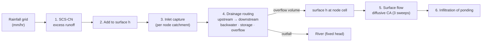

# Hydraulics: the coupled 1D–2D urban flood model

Sources: `backend/app/engines/hydro.py` (model), `engines/world.py` (network construction and pipe sizing),
`engines/hub.py` (baseline and forecast runs).

The model is a transparent baseline built on SWMM-compatible concepts. It couples:

- a **2D surface layer**: water depth *h* on the 48 × 48 DEM grid, and
- a **1D drainage network**: a directed forest of inlets → manholes/junctions → outfalls.

The model advances in **5-minute steps** (`DT_MIN = 5`). Each step runs six stages.



## 1. Runoff: SCS Curve Number

For each cell the model uses **cumulative** rainfall P (mm) since the start of the event:

```
S  = 25400 / CN − 254                    (mm, potential retention)
Ia = 0.2 · S                             (initial abstraction)
Q  = (P − Ia)² / (P + 0.8 · S)  if P > Ia, else 0
runoff this step = Q(t) − Q(t − Δt)      (mm → m added to h)
```

CN comes from land cover (94 dense urban, 86 residential, 92 commercial, 61 parks, 98 water, 77 bare soil). The What-If
`imperviousness_delta` d shifts CN towards 98 (`CN + d·(98 − CN)`) when d > 0, or towards 40 (`CN + d·(CN − 40)`)
when d < 0, clipped to 30–98. The runoff rate per cell (m³/s) is reported for the runoff maps.

## 2–3. Surface store and inlet capture

Surface water is summed over each drainage node's catchment. Every grid cell belongs to its nearest non-outfall node
(inlet, manhole or junction), found with a KD-tree Voronoi assignment. Capture at node *k* in one step is:

```
capture = min( surface volume in catchment,
               inlet capacity   = Q_pipe,k / capacity_factor · 1.3 · (1 − blockage_k) · Δt,
               free room        = Q_pipe,k · bw · Δt + (storage_max − stored) − upstream inflow )
```

`Q_pipe,k` already includes the `(1 − blockage)` derating, so inlet efficiency scales as **(1 − blockage)²**. This
reflects that clogged grates reduce capture faster than conveyance. The captured fraction is removed uniformly from
the catchment's cells.

## 4. Drainage hydraulics (1D)

### Network construction and pipe sizing (`world._build_drainage`)

- **Topology.** Candidate links follow the road graph, and each outfall is linked to its 3 nearest junctions. A
  **priority-flood from the outfalls** (a min-heap on node elevation) builds a drainage *forest*: each node's
  `downstream` is the neighbour it was reached from. Links therefore run mostly downhill, with some adverse grades.
  Street inlets at segment midpoints discharge into the lower end of their segment.
- **Topological order.** Nodes are sorted by depth in the forest, from upstream (deepest) to downstream. Routing runs
  in this order, so each node sees all its upstream inflow in the same step.
- **Inverts.** Ground elevation − 2.0 m for manholes and junctions, − 1.2 m for inlets, − 0.5 m for outfalls. The slope
  is the invert difference ÷ length (length ≥ 25 m). A slope ≤ 0.0005 is flagged `adverse_grade`.
- **Design flow (rational method).**
  `Q_design = i_design · Σ(C·A)_upstream / 3.6×10⁶` (m³/s, with i in mm/hr and A in m²). Design intensity is
  55 mm/hr (60 mm/hr for Mumbai). Contributing C·A is accumulated down the tree.
- **As-built variability.** The design flow is multiplied by U(0.9, 1.3). 13 % of conduits are **legacy undersized**
  at U(0.45, 0.65). The minimum is 0.08 m³/s.
- **Manning full-pipe capacity.** For a circular section:
  `Q = (1/n) · A · R^(2/3) · S^(1/2)`, with `A = πD²/4`, `R = D/4`, `n = 0.013`. The diameter is found by bisection
  in 0.3–6.0 m so that Q ≥ the target, using `S_eff = max(S, 0.001)`. Capacity is then recomputed for the chosen D.
  Conduits with D > 2.2 m are labelled `box_drain`. Full-flow velocity is reported.
- **Assumed condition (SIMULATED, no sensors).** `days_since_cleaning` ~ U(5, 240) and
  `baseline_blockage = clip(days/240 · 0.22 + N(0, 0.03), 0, 0.35)`. `historical_failures` ~ Poisson
  (1.5 for legacy conduits, otherwise 0.4).
- **Storage.** 25 m³ per manhole/junction and 8 m³ per inlet.

### Effective capacity

```
Q_pipe,k = Q_manning · capacity_factor · (1 − blockage_k) · (tailwater factor, outfalls only)
tailwater factor = clip(1 − max(0, tailwater − 0.5) / 2.5, 0.1, 1)
```

### Routing, backwater, surcharge and overflow (per node, upstream → downstream)

```
bw        = 1 − 0.45 · surcharge(downstream)            (downstream manhole)
          = max(0.35, 1 / r_outfall) if r_outfall > 1    (downstream outfall inflow/capacity ratio)
cap_vol   = Q_pipe,k · bw · Δt
total     = upstream inflow + stored + capture
outflow   = min(total, cap_vol)             → added to the downstream node's inflow
left      = total − outflow
overflow  = max(0, left − storage_max)      → returned to the surface at the node's cell
stored    = left − overflow;   surcharge = stored / storage_max
```

**Utilisation** compares what the catchment *asks* the drain to carry with what the derated pipe *can* carry:
`util = (upstream + min(surface, clean-inlet capacity)) / Δt ÷ Q_pipe,k`. With this definition, blockage raises
utilisation even though less water actually enters the pipe. Outfalls report `inflow / capacity`. An outfall ratio
> 1 is flagged as backflow and throttles the upstream node on the next step.

### Node states

| State | Rule |
|---|---|
| NORMAL | utilisation < 0.6 |
| HIGH_LOAD | 0.6 ≤ utilisation < 0.8 |
| NEAR_CAPACITY | 0.8 ≤ utilisation < 1.0 |
| OVERLOADED | utilisation ≥ 1.0 (surcharged) |
| OVERFLOW | overflow > 0.5 m³ in the step (water leaving the manhole to the street) |

A conduit is flagged as a **bottleneck** when its upstream node's utilisation is ≥ 1 and the conduit is legacy
undersized or has an adverse grade. As the demo storm ramps from 20 to 120 mm/hr, the network moves from all-NORMAL
(t = 5 min) to about 97 % OVERLOADED/OVERFLOW (t = 120 min). The test suite checks that this
progression is monotonic.

## 5. Surface flow: diffusive cellular automaton (2D)

Water moves on the water-surface elevation `η = z + h`, with 3 sweeps per step:

```
for each of the 4 neighbours j:   q_j = α · max(η_i − η_j, 0)          (α = 0.22)
if Σ q_j > h_i:                   scale all q_j by h_i / Σ q_j          (no negative depth)
h_i −= Σ q_j;   h_j += q_j
```

Domain edges are edge-padded, which makes them reflective. River cells are reset to a fixed head
`h_river = max(0, tailwater − 0.5) · 1.5` after every sweep, so they act as the receiving water body. This is a
volume-conserving, gravity-driven diffusive scheme. It is not a shallow-water (momentum) solver, so it represents where
water ponds and how it spreads between 5-minute steps, not flow velocities.

## 6. Infiltration of ponded water

Ponded water on pervious surfaces infiltrates at `15 mm/hr · (1 − imperviousness)`. Depths below 0.1 mm are set to 0.
Depths never go negative (tested).

## Flood thresholds used downstream

| Threshold | Value | Use |
|---|---|---|
| Cell flooded | h ≥ 0.10 m | flood extent, zones, validation |
| Road flooded | max depth over the road's cells ≥ 0.15 m | time-to-flood, flooded-road counts, ML label |
| Passability | 0.05 / 0.15 / 0.30 / 0.50 m | PASSABLE → … → IMPASSABLE |

## Runs

- **Baseline (current conditions).** 0 → 360 minutes on the simulated storm, computed once per city at startup. All
  states are kept.
- **Forecast.** At step t, the model starts from the stored state at t and runs 180 minutes driven by the 36 nowcast
  rainfall fields.
- **What-If.** Two independent runs over `duration + 60` minutes (baseline and scenario parameters). See
  [SIMULATION.md](SIMULATION.md).
- **Tailwater and initial conditions.** A higher river level reduces outfall capacity, raises the river head, and
  pre-fills manhole storage (`min(1, (tailwater − 0.5)/3)`). An initial surface depth can also be set.

## SWMM compatibility notes

The model's objects correspond directly to EPA SWMM 5 objects. **This build does not read or write `.inp` files.**
The table shows how an exporter or importer would map them:

| FloodShield object | SWMM section | Mapping |
|---|---|---|
| manhole / junction node | `[JUNCTIONS]` | `Elevation` = `invert_m`; `MaxDepth` = `elevation_m − invert_m`; `SurDepth` 0. `storage_m3` has no direct equivalent; approximate it with a small `[STORAGE]` unit or omit it. |
| inlet node | `[JUNCTIONS]` + `[INLETS]` / `[INLET_USAGE]` (SWMM 5.2) | inlet capture efficiency ↔ `(1 − blockage)`; `PercentClogged` = blockage × 100 |
| outfall | `[OUTFALLS]` | `FIXED` stage = river tailwater, or a `TIMESERIES` stage for tidal/river hydrographs |
| conduit (`pipe`) | `[CONDUITS]` + `[XSECTIONS]` | `CIRCULAR`, `Geom1` = `diameter_m`; `Roughness` 0.013; `Length` = `length_m`; offsets 0 |
| conduit (`box_drain`) | `[CONDUITS]` + `[XSECTIONS]` | `RECT_CLOSED`; an equivalent section can be derived from the diameter |
| node catchment (Voronoi cells) | `[SUBCATCHMENTS]`, `[SUBAREAS]`, `[INFILTRATION]` | area = `catchment_m2`; `%Imperv` = mean imperviousness; infiltration method `CURVE_NUMBER` with area-weighted CN; outlet = node |
| rainfall grid | `[RAINGAGES]` + `[TIMESERIES]` | one gauge per catchment (cell-mean intensity) at 5-minute INTENSITY |
| surface grid | — | SWMM is 1D; use a 2D coupling (e.g. PCSWMM 2D or a separate 2D model) or represent street ponding with `[STORAGE]` nodes or the `Aponded` ponded-area option |

Two further differences apply to a SWMM run. SWMM's dynamic-wave routing solves St. Venant momentum and pressurised
flow, whereas this model routes volume with capacity limits and an empirical backwater factor. Results from a
calibrated SWMM model should therefore be preferred for engineering design. FloodShield's role is fast, explainable
nowcast-driven screening.
